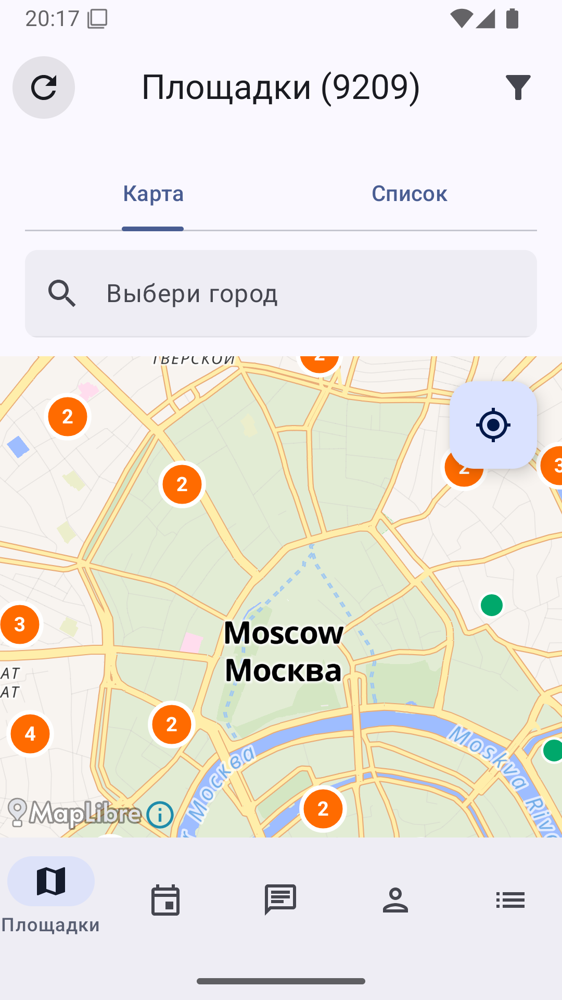
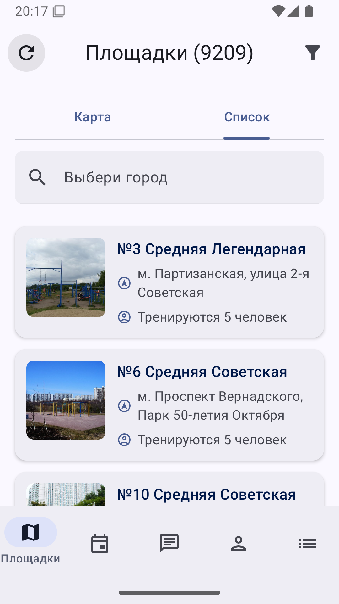
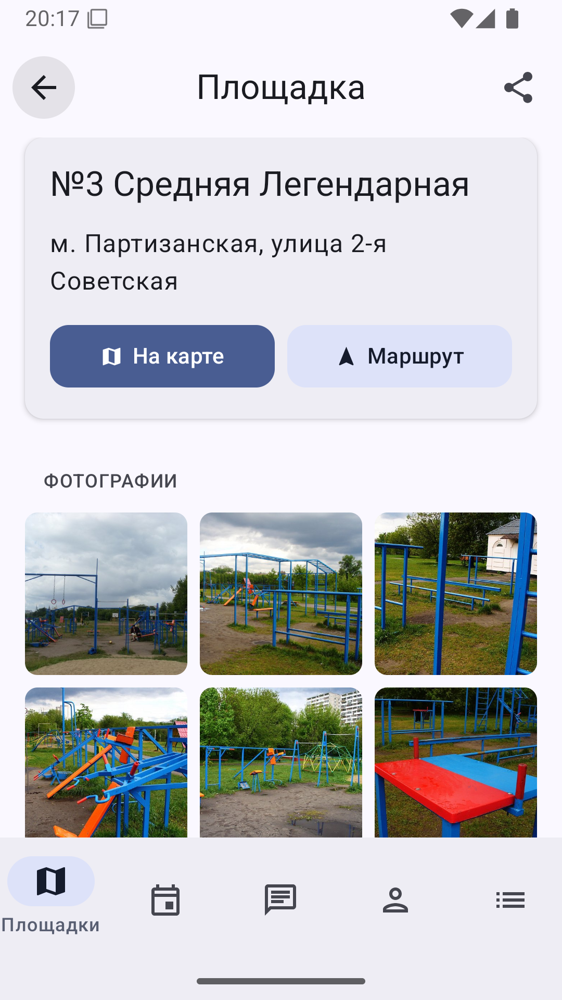
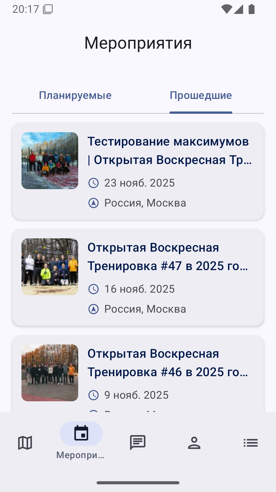
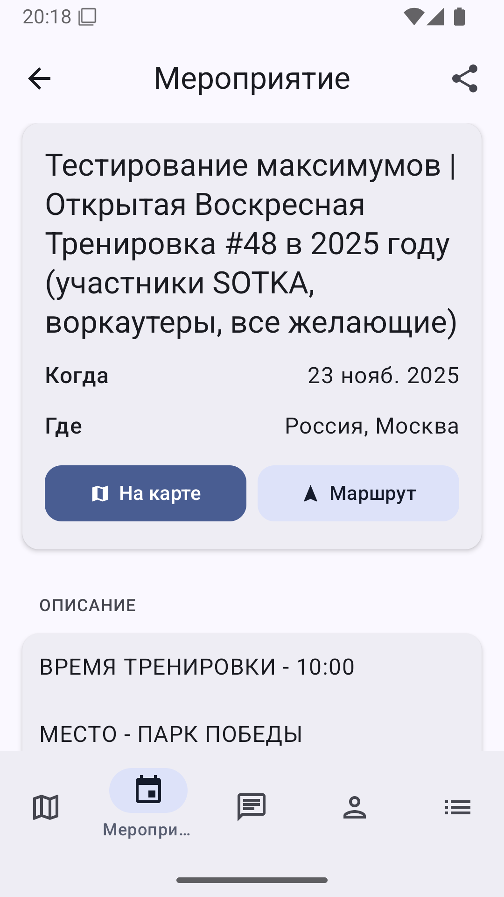
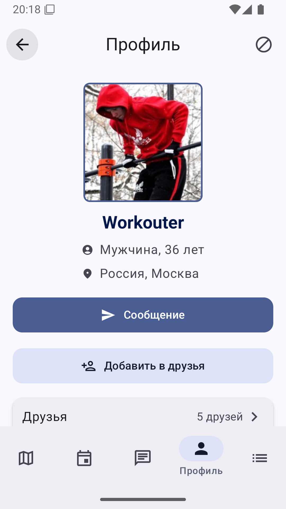

# SW Площадки

<!-- BEGIN_VERSIONS -->
[](https://kotlinlang.org/)
[](https://developer.android.com/)
[](https://developer.android.com/)
[](https://gradle.org/)
[](https://developer.android.com/tools/releases/gradle-plugin)
<!-- END_VERSIONS -->
[](https://gitmcp.io/easydev991/Jetpack-WorkoutApp)

- Это Android-версия моего пет-проекта "Street Workout Площадки", которая повторяет функциональность [iOS-версии](https://github.com/easydev991/SwiftUI-WorkoutApp) по мере возможности
- [Ссылка на старое приложение в Play Market](https://workout.su/android)

## Скриншоты

1. Сгенерировать скриншоты:

```shell
make screenshots
```

2. Обновить пути в таблице README на последние PNG:

```shell
make update_readme
```

| Карта с площадками                                                                                        | Список площадок                                                                                            | Площадка                                                                                                     | Прошедшие мероприятия                                                                                       | Мероприятие                                                                                                   | Профиль                                                                                                  |
|-----------------------------------------------------------------------------------------------------------|------------------------------------------------------------------------------------------------------------|--------------------------------------------------------------------------------------------------------------|-------------------------------------------------------------------------------------------------------------|---------------------------------------------------------------------------------------------------------------|----------------------------------------------------------------------------------------------------------|
|  |  |  |  |  |  |

## Документация

- [План разработки приложения](docs/plan-development.md)
- [API](docs/doc-api-implementation.md)

## Помощь проекту

Информация о том, как внести вклад в проект, доступна в [CONTRIBUTING.md](.github/CONTRIBUTING.md)
