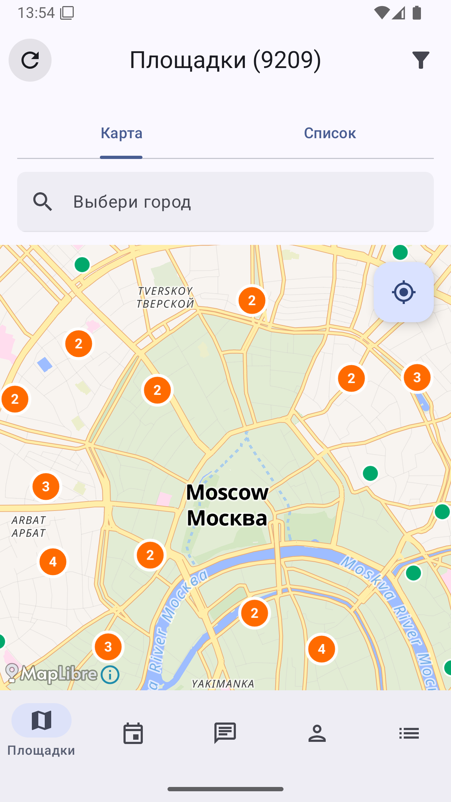
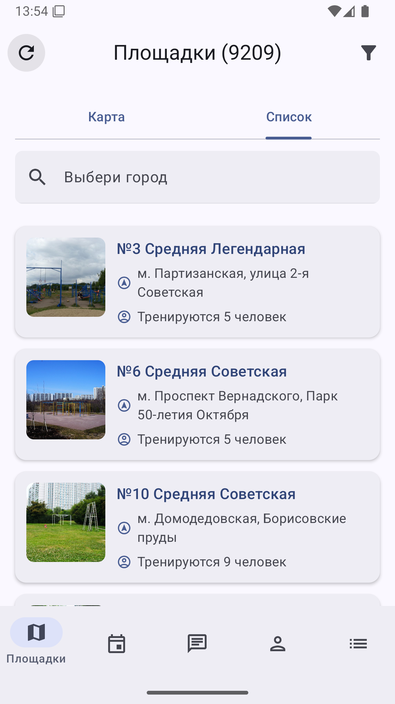
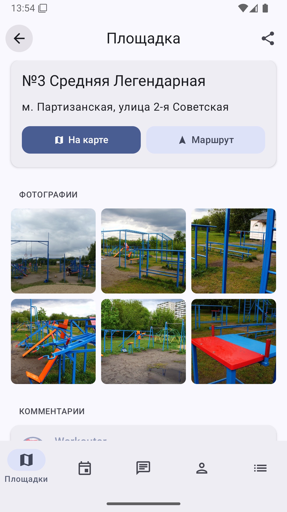
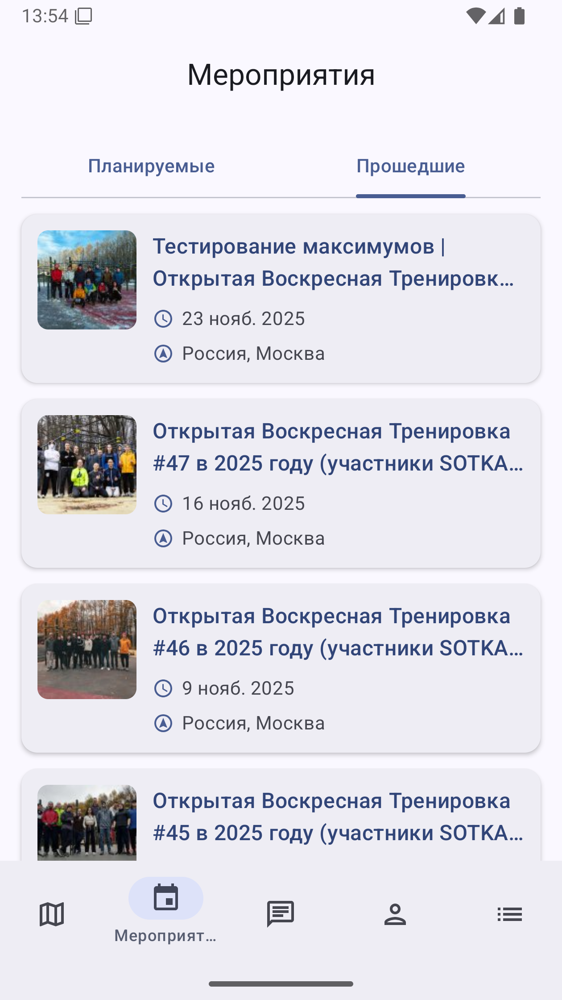
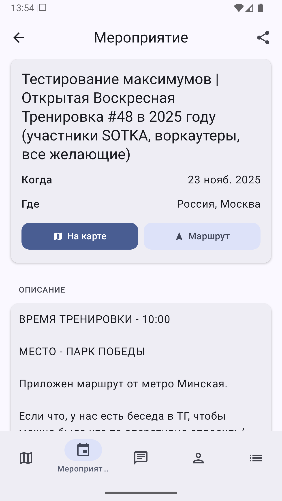
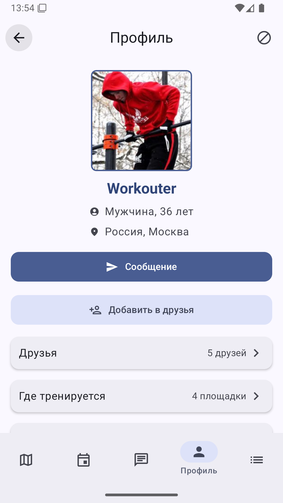

# SW Площадки

<!-- BEGIN_VERSIONS -->

<!-- END_VERSIONS -->

> **ℹ️ Сайт `workout.su` [заморожен](https://workout.su/news/5238-sajt-workout-su-budet-zamorozhen-30-sentjabrja-2026) 30 сентября 2026 года.**  Приложение может работать нестабильно или вообще не работать, потому что все данные хранятся на сервере.

## Реализованный функционал

- Описание всех экранов и функций приложения доступно в [карте экранов и функционала](docs/feature-map.md).
- Версия для iOS [тут](https://github.com/easydev991/SwiftUI-WorkoutApp).

## Помощь в разработке

Прежде чем что-то делать, ознакомься с [правилами](.github/CONTRIBUTING.md), пожалуйста.

## Скриншоты

| Карта с площадками                                                                                        | Список площадок                                                                                            | Площадка                                                                                                     | Прошедшие мероприятия                                                                                       | Мероприятие                                                                                                   | Профиль                                                                                                  |
|-----------------------------------------------------------------------------------------------------------|------------------------------------------------------------------------------------------------------------|--------------------------------------------------------------------------------------------------------------|-------------------------------------------------------------------------------------------------------------|---------------------------------------------------------------------------------------------------------------|----------------------------------------------------------------------------------------------------------|
|  |  |  |  |  |  |

## Документация

- [План разработки приложения](docs/plan-development.md)
- [API](docs/doc-api-implementation.md)
- [Скриншоты](docs/doc-android-screenshot-automation.md)
- Остальная документация есть в папке [docs](docs)
